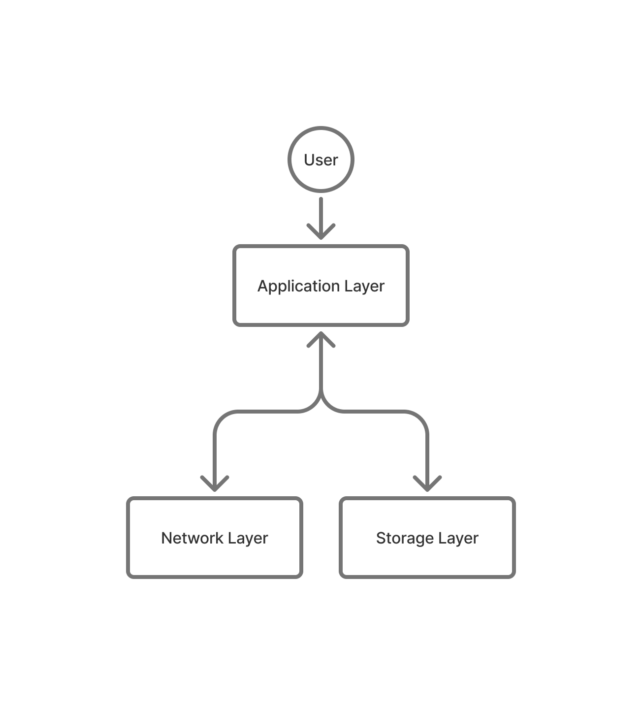

# CRDTSign
This document details the use case provided by the CRDTSign application. For this purpose, we assume the following:
- The system runs on a distributed network consisting of at least one node
- Each user connects to its own personal node in the network
- Users can interact with the application concurrently with other users

## Technical Overview
The CRDTSign system can be subdivided into the following layers:
- **Storage Layer**: The system manages the storage/persistence of file signature and user data in order to make it available to the user -- for simplicity, this is achieved by flushing the contents of the custom CRDT data structures to binary files after 
each successful update operation done locally.
- **Network Layer**: The system handles the communication of updates operations to CRDTs between nodes in the network.
- **Application Layer**: The system provides a user interface for interacting with the CRDTs and the network.

## Use Case
The use case presented by the CRDTSign application is as follows:
1. A user connects to a node in the network via the web browser of their preference.
    - If the user is accessing the application for the first time, the system creates a new user profile, assigning it a unique identifier and key pair (private and public keys, generated using the Ed448 scheme) and saves the information locally.
    - Otherwise, the system retrieves the user profile from local storage.
2. The system displays the user interface in the web browser. Within the interface, the user can perform the following actions:
    - **Sign a File**: The user can select a file from their local storage. The system retrieves the user's private key and applies the Ed448 signature algorithm over the file's digest (computed in SHA-256). An update operation is issued contaning a unique identifier for the file, the signing user's identifier and the resulting signature; this update is both applied to the local file signature CRDT storage, and broadcasted to all other nodes in the network. Optionally, the user can also provide an expiration date and time, after which the file signature will be considered invalid.
    - **View File Signatures**: The user can view details for previously generated file signatures. For each file signature, the user can display all relevant details, issue a signature validation request, or delete the file signature entry itself. Validation requests occur by retrieving the public key of the signing user from the dedicated CRDT storage, and applying the Ed448 signature verification algorithm over the file's signature. The system displays a positive outcome if the verification algorithm is successful (and, in the eventuality that an expiration date and time was assigned by the signing user, if the selected signature has not yet expired), or a negative outcome otherwise. Whenever an updated operation is received from the network, the system updates the available file signatures accordingly.
    > Due to the system being accessible by multiple concurrent users, the system handles the
    > concurrent modification of the CRDT storage in real time, and updates the user interface(s)
    > accordingly.
    - **Manually Validate a Signature**: The user can manually input the relevant information required to validate a file signature; namely, the file itself (of which the system computes the SHA-256 digest), the file's signature, and the signing user's public key. The system applies the Ed448 signature verification algorithm over the file's signature, and displays a positive outcome if the verification algorithm is successful, or a negative outcome otherwise.